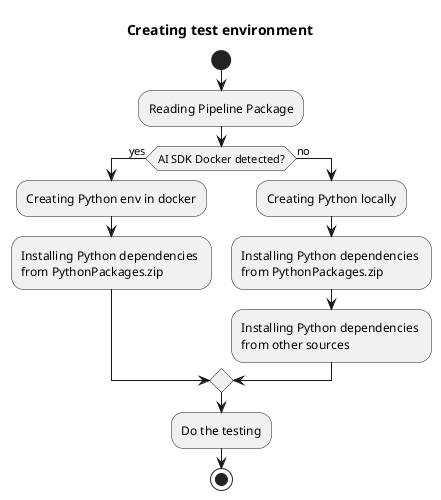

<!--
SPDX-FileCopyrightText: 2025 Siemens AG

SPDX-License-Identifier: MIT
-->

# Using LocalpipelineRunner in docker environment

This document explains how to create a Docker image that closely matches the environment used by the Pipeline in the AI Inference Server.

The Docker image is based on the same runner environment as the Python steps, and includes only the libraries and packages that are present in the actual production environment.

With this setup, the LocalPipelineRunner is able to
- Use the exact same Python environment as production
- Install step requirements using only the packaged dependencies
- Detect Python dependencies that are packaged but incompatible with the environment

## LocalPipelineRunner Workflow

When the LocalPipelineRunner is started inside the Docker container:
- It detects the presence of the `/.ai_sdk_docker` file
- It creates a `docker` object responsible for managing and working within the appropriate virtual environments
- It installs Python dependencies exclusively from the step's `PythonPackages.zip` file



## Building the Docker Image

This workflow outlines the steps to prepare and build Docker images for a Python-based vessel application:


```commandline
cp simaticai-2.5.0-py3-none-any.whl docker

cd docker
docker build -t python-vessel-base -f DockerfileBase .
docker build -t iai-sdk-python-runner .
```

1. Copy the required Python wheel file (`simaticai-2.5.0-py3-none-any.whl`) into the `docker` directory. This file contains the necessary Python package for the application.
2. Change the working directory to `docker` to access the Docker build context and Dockerfiles.
3. Build the base Docker image using the `DockerfileBase` file and tag it as `python-vessel-base`. This image serves as the foundational environment for subsequent images.
4. Build the main application Docker image using the default `Dockerfile` in the current directory and tag it as `iai-sdk-python-runner`. This image includes the application and its dependencies, ready for deployment or further use.


## Running the Pipeline

This workflow demonstrates how to run a pipeline using the `iai-sdk-python-runner` Docker image. 

```commandline
cd [your-test-folder]
docker run -v $(pwd):/workspace iai-sdk-python-runner simaticai run_pipeline SimplePipeline-edge_1.zip --data data.csv
```

It mounts the current working directory into the container at `/workspace`, allowing the container to access local files. 
The command executes the `simaticai run_pipeline` operation with the specified pipeline archive (`SimplePipeline-edge_1.zip`) and input data file (`data.csv`). 
Replace `[your-test-folder]` with the appropriate directory containing your files before running the command.

## Using Docker Images as a Dev Container

To use the `iai-sdk-python-runner` Docker image as your development environment, configure your `.devcontainer/devcontainer.json` file to reference this image. This setup enables you to leverage Visual Studio Code Dev Containers, providing a consistent and production-like environment for pipeline development and testing.

By developing inside a Dev Container, you ensure that your code runs in the same environment as production, reducing environment-related issues. This approach supports seamless use of the LocalPipelineRunner and allows for comprehensive testing and debugging directly within VS Code.

For example, your `.devcontainer/devcontainer.json` might include:

```json
{
  "name": "AI Pipeline Dev Container",
  "image": "iai-sdk-python-runner",
  "workspaceFolder": "/workspace",
  "mounts": [
    "source=${localWorkspaceFolder},target=/workspace,type=bind"
  ],
  "settings": {},
  "extensions": [
    "ms-python.python"
  ]
}
```

This configuration ensures that your development workflow is aligned with the production environment, streamlining both development and deployment processes.
